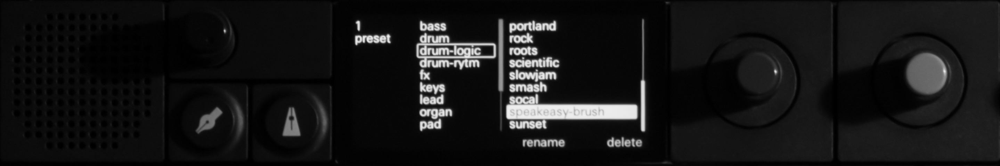

# Logic Pro Drum Kit Exporter for OP-XY

Export drum kits from Logic Pro / Garage Band's Drum Kit Designer to Teenage Engineering OP-XY format. I built this tool because I wanted more acounstic drum sounds on my OP-XY.



## Overview

This tool provides a three-step workflow to convert Logic Pro drum kits into OP-XY compatible drum kit presets:

1. **Generate MIDI** - Create a MIDI file that triggers each drum sample sequentially
2. **Bounce in Logic** - Import the MIDI, select your kit, and bounce to audio
3. **Splice & Export** - Automatically split the audio into individual samples and package as OP-XY preset

## Pre-built Kits

Ready-to-use OP-XY drum kits exported from Logic Pro can be downloaded from the [Releases](../../releases) page.

## Requirements

- Python 3.10+
- Logic Pro (you must own a valid license)
- Required Python packages:

```bash
pip install mido soundfile numpy scipy
```

## Quick Start

### Step 1: Generate the MIDI trigger file

```bash
python generate_drum_midi.py --mapping logic_drum_mapping_standard.json --spacing 2.0
```

This creates:
- `drum_trigger.mid` - MIDI file with 24 sequential drum hits
- `drum_trigger.timing.txt` - Timing info for the splicer

### Step 2: Bounce in Logic Pro

1. Create a new project in Logic Pro
2. Add a **Drum Kit Designer** track
3. Select your desired drum kit
4. Import `drum_trigger.mid` onto the track
5. **File → Bounce → Project or Section**
   - Format: WAV
   - Sample Rate: 44100 Hz
   - Bit Depth: 16-bit
   - Normalize: Off

### Step 3: Splice and export to OP-XY

```bash
python splice_and_export.py bounced_audio.wav --name "My Kit Name"
```

This creates a `.preset.zip` file ready to transfer to your OP-XY.

## Mapping Files

Two mapping configurations are included:

### Standard Kit (`logic_drum_mapping_standard.json`)

24 samples covering the standard GM drum sounds:
- Kick, Snares (center, edge, rimshot, sidestick)
- Hi-Hats (closed, open, pedal, foot)
- Toms (floor, low, mid, high)
- Cymbals (crashes, rides, china, splash)
- Cowbell

### Brush Kit (`logic_drum_mapping_brush.json`)

Optimized for brush kits with special articulations:
- Standard drums (kick, snares, hi-hats, toms, rides)
- Brush-specific: Sweep Stroke, Sweep Accents, Snare Center Mutes

## OP-XY Slot Reference

| Slot | OP-XY Note | Default Assignment |
|------|------------|-------------------|
| 0 | F#3 (53) | Kick |
| 1 | G3 (54) | Snare Side Stick |
| 2 | G#3 (55) | Snare Center |
| 3 | A3 (56) | Snare Edge |
| 4 | A#3 (57) | Snare Rimshot |
| 5 | B3 (58) | Snare Rimshot Edge |
| 6 | C4 (59) | Hi-Hat Closed |
| 7 | C#4 (60) | Hi-Hat Pedal |
| 8 | D4 (61) | Hi-Hat Open |
| 9 | D#4 (62) | Hi-Hat Foot Close |
| 10 | E4 (63) | Hi-Hat Foot Splash |
| 11 | F4 (64) | Floor Tom Low |
| 12 | F#4 (65) | Floor Tom High |
| 13 | G4 (66) | Low Tom |
| 14 | G#4 (67) | Mid Tom |
| 15 | A4 (68) | High Tom |
| 16 | A#4 (69) | High Tom Alt |
| 17 | B4 (70) | Ride Bow |
| 18 | C5 (71) | Ride Bell |
| 19 | C#5 (72) | Crash/Sweep* |
| 20 | D5 (73) | Crash/Sweep* |
| 21 | D#5 (74) | China/Sweep* |
| 22 | E5 (75) | Splash/Mute* |
| 23 | F5 (76) | Cowbell/Mute* |

*Slots 19-23 vary between standard and brush kits*

## License & Disclaimer

This tool is provided for personal use only.

**You must own a valid license for Apple Logic Pro to use this tool.** The drum samples and sounds within Logic Pro are the intellectual property of Apple Inc. This tool merely facilitates exporting your own bounced audio for use on personal hardware. The authors of this tool are not affiliated with Apple Inc. or Teenage Engineering.

If you find it useful, consider buying me a coffee ;-)

<a href="https://ko-fi.com/inrainbws"></a>
